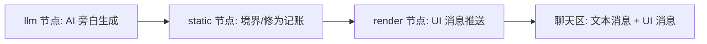

## 插件如何工作

插件为场景注册一个**上下文**：独立的系统提示词、可见工具集与压缩配置。宿主的对话循环在回合内自动进入、退出该上下文，游戏逻辑与编码场景互不污染。

注册上下文时，插件也注册**工具**与 **Flow 图**。工具的 run() 内部就是一张图——把「生成、记账、渲染」拆为节点，由宿主托管执行：



## 业务模型：四层设计

修仙世界的业务模型没有让 AI 自由发挥，而是拆成四层，各自有明确边界：

| 层 | 内容 | 谁负责 |
|---|---|---|
| **世界** | 区域、宗门、城镇、出身/天资池、NPC 池 | 静态规则 + LLM 生成 |
| **角色** | 姓名、境界、修为、生命、功法、丹药 | 静态规则（LLM 不碰数值） |
| **纪元** | 五十年大事件时间线、纪元史（多周目） | 静态规则 + LLM 叙事 |
| **回合** | 当前事件、闭关/行动推进、好感/道侣/记忆 | Flow 图串起 LLM 与规则 |

核心原则：**LLM 只负责叙事与判断，数值一律静态节点结算**——`筑基三层 · 经验 2400/5000`、`HP 78/100` 由规则确定，行为可预期、回放可复现。

## 8 个工具：每个对应一个游戏环节

插件注册了 8 个工具，分别覆盖业务模型的各个环节：

| 工具 | 对应环节 | 说明 |
|---|---|---|
| `create_world` | 开局创世 | 清空世界 → 生成世界骨架、出身/天资池、推世界屏；成功后紧跟 NPC 与大事件生成 |
| `create_character` | 建角 | 从出身/天资池选出身天资、取名建角、推首屏 |
| `reset_character` | 重来本世 | 保留世界与大事件，仅清空角色从池中重建 |
| `generate_npcs` | 生态扩充 | 生成一批 NPC（凡人 2 + 修士 7 + 大修士 1），自动防重名，可多批扩充 |
| `generate_major_events` | 大事件时间线 | 生成未来五十年 15-30 条大事件（at/by/type/summary），补充世界时间线 |
| `game_turn` | 回合推进 | 推进剧情：加月、切主修/突破、闭关时长；搜刮丹药功法、好感/道侣/记忆在此表达 |
| `game_query` | 静态查问 | 纯静态 LLM 查询：世界观/数值/档案/NPC 信息，不推时间 |

分工逻辑：**初始化链**（create_world → generate_npcs → generate_major_events）由规则约束时序；**玩法主循环**由 game_turn 承担；**元操作**（reset）单独成工具，避免污染主流程。

## 三种节点

### LLM 生成节点

调用宿主 LLM 生成剧情文本。提供 JSON Schema 时要求结构化输出，校验失败自动重试（默认 2 次），保证叙事与分支稳定。文本以**文本消息**流式渲染进聊天区。

### 静态逻辑节点

纯函数：维护玩家状态（姓名、修为、境界、生命值），做门控与结算。`筑基三层 · 经验 2400/5000`、`HP 78/100` 这样的进度由静态节点确定，AI 只负责叙事，不负责算数——行为可预期，回放可复现。

### 渲染终止节点

把状态与选项经 push 通道推成 **UI 消息**：PlayerStatus 状态栏、StorySummary 剧情摘要、ChoiceCardList 选项卡片，直渲染进对话流，与文本消息共同落库、可回放。

## 交互流程

```
剧情推进 → 文本消息: 完整旁白 + UI 消息: 状态栏/选项卡片
  → 用户点击选项卡片
  → 新剧情生成 → 聊天区追加新的文本消息
  → UI 消息更新状态栏与选项
```

## 记忆与压缩

- 慢变记忆（世界设定卡）写入 host_memory，按会话 + 上下文分层，注入游戏上下文的**稳定系统提示词前缀**
- 压缩层按游戏上下文单独配置：剧情史摘要槽位、预算与保留 token——长剧情不丢关键状态，token 也花在刀刃上

## 源码在哪？

[proactive-ai-cultivation](https://github.com/prisflow/proactive-ai-cultivation) 是完整的官方示例：从上下文注册、8 个工具与 Flow 定义，到 UI 消息与记忆写入都有清晰范例。
