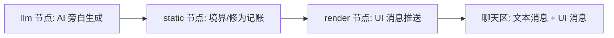

## 插件如何工作

插件为场景注册一个**上下文**：独立的系统提示词、可见工具集与压缩配置。宿主的对话循环在回合内自动进入、退出该上下文，游戏逻辑与编码场景互不污染。

注册上下文时，插件也注册**工具**与 **Flow 图**。工具的 run() 内部就是一张图——把「生成、记账、渲染」拆为节点，由宿主托管执行：



## 三种节点

### LLM 生成节点

调用宿主 LLM 生成剧情文本。提供 JSON Schema 时要求结构化输出，校验失败自动重试（默认 2 次），保证叙事与分支稳定。文本以**文本消息**流式渲染进聊天区。

### 静态逻辑节点

纯函数：维护玩家状态（姓名、修为、境界、生命值），做门控与结算。`筑基三层 · 经验 2400/5000`、`HP 78/100` 这样的进度由静态节点确定，AI 只负责叙事，不负责算数——行为可预期，回放可复现。

### 渲染终止节点

把状态与选项经 push 通道推成 **UI 消息**：PlayerStatus 状态栏、StorySummary 剧情摘要、ChoiceCardList 选项卡片，直渲染进对话流，与文本消息共同落库、可回放。

## 交互流程

```
剧情推进 → 文本消息: 完整旁白 + UI 消息: 状态栏/选项卡片
  → 用户点击选项卡片
  → 新剧情生成 → 聊天区追加新的文本消息
  → UI 消息更新状态栏与选项
```

## 记忆与压缩

- 慢变记忆（世界设定卡）写入 host_memory，按会话 + 上下文分层，注入游戏上下文的**稳定系统提示词前缀**
- 压缩层按游戏上下文单独配置：剧情史摘要槽位、预算与保留 token——长剧情不丢关键状态，token 也花在刀刃上

## 源码在哪？

[proactive-ai-cultivation](https://github.com/prisflow/proactive-ai-cultivation) 是完整的官方示例：从上下文注册、工具与 Flow 定义，到 UI 消息与记忆写入都有清晰范例。
