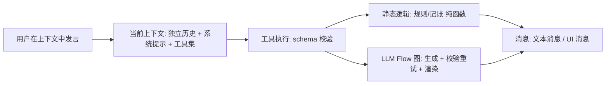

## Proactive AI 是什么？

Proactive AI 是一款**会自己切换上下文的 AI 聊天助手**。

大多数聊天的难题不是模型不够聪明，而是**上下文一团糟**：写着代码突然问你食谱，聊着游戏突然切回工作，历史又长又杂。Proactive AI 的核心思路是——把对话按 **场景（上下文）** 组织，宿主自动管理切换，让每个场景保持干净、可预测的上下文。

## 对话的结构：上下文 → 工具 → 静态逻辑 / LLM Flow

一轮对话的组织顺序是这样的：

- **上下文**：每个场景（编码、游戏、资料整理）拥有独立历史、系统提示词与工具集
- **工具**：上下文决定可用工具集，工具执行前经 schema 校验
- **静态逻辑**：规则、记账、状态结算由纯函数节点处理，行为确定
- **LLM Flow**：生成类动作拆为 Flow 图，LLM 节点负责生成，schema 校验失败自动重试

宿主自动完成进/出切换：进入子上下文保存状态，退出时总结回注主上下文，无需用户手动干预。

## 两种消息形态

对话流里的消息分两类：

- **文本消息**：LLM 流式输出的对话文本，Markdown / 代码高亮 / Mermaid 渲染
- **UI 消息**：工具产出的界面组件——按钮、状态面板、选项卡片，与文本消息同等可回放、可落库

二者共存于同一对话流，游戏中"剧情文本（文本消息）+ 状态栏（UI 消息）"就是这样实现。

## 压缩层：按上下文调优

长对话最大的成本是 token。Proactive AI 的压缩层为**每个上下文暴露配置 API**：

- 触发压缩的 token 预算
- 摘要写入的记忆槽位与标签
- 压缩后保留的消息 token 数
- 是否启用再压缩（摘要的摘要）

开发者按场景配置压缩策略，而非一套逻辑打天下。

## 分层记忆 × 系统提示词

记忆按会话 + 上下文分层，与**对应上下文的系统提示词**稳定拼接：慢变记忆（如世界设定卡）注入稳定前缀。由于前缀内容固定不变，**缓存命中率在长期使用中可达 90%–95% 甚至更高**——同一会话来回多次对话，大部分请求直接命中 prompt cache，大幅节约 token 使用成本。

## 隐私优先：所有数据本地化

聊天记录、记忆、插件状态与配置**全部落在本地 SQLite**。数据不经过我们的服务器，只在你本机与你配置的模型服务之间直接交换。

## 下一步

Proactive AI 处于早期阶段，插件分发与维护方案仍在设计中。想了解插件实现？查看[修仙插件源码](https://github.com/prisflow/proactive-ai-cultivation)与[开源仓库](https://github.com/prisflow/proactive-ai-desktop)。
